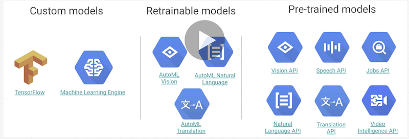

# Python

Complete Python Developer in 2020: Zero to Mastery Created by Andrei Neagoie

## Section 1: Introduction

- Course Outline
- Join Our Online Classroom!
- Discord Community

## Section 2: Python Introduction

### What Is A Programming Language

- Source code (human readable)
  - => interpreter: goes line by line and executes it consecutively
  - => or compiler: takes code all at once, reads the entire file and then translates that to machine code.

### [Python Interpreter](https://www.python.org/)

- cypthon VM (virtual machine)

### How to Run Python Code

- Terminal
- Code Editors: sublime text, visual studio code
- IDEs: PyCharm, Spyder
- Notebooks: jupyter
- `python3`
- `exit()`
- `python main.py`

### Python 2 vs Python 3

- Python3 introduced in 2008
- [The Story of Python](https://www.youtube.com/watch?v=J0Aq44Pze-w)
- [Python 2 vs Python 3](https://www.geeksforgeeks.org/important-differences-between-python-2-x-and-python-3-x-with-examples/)
- [Another Article](https://sebastianraschka.com/Articles/2014_python_2_3_key_diff.html)

### [Why So Many Languages](https://en.wikipedia.org/wiki/List_of_programming_languages)

- Languages have tradeoffs, so choose depending on purpose
- Python is great for developer code

### [ZTM Python Cheat Sheet](https://zerotomastery.io/courses/python/cheatsheet/?utm_source=udemy&utm_medium=coursecontent)

## Section 3: Python Basics

### Learning Python

- Terms
- Data Types
- Actions
- Best Practices

### Python Data Types

- Numbers
- [Math Functions](https://www.programiz.com/python-programming/modules/math)

### Developer Fundamentals I

- Learn a language by using it not by memorizing it.

### Operator Precedence

### Optional: bin() and complex

### Variables

- [Python Keywords](https://www.w3schools.com/python/python_ref_keywords.asp)
- Best Practices
  - snake_case
  - start with lowercase or underscore
  - letters, numbers, underscores
  - case sensitive
  - don't overwrite keywords
  - CONSTANTS are CAPITALIZED

### Expressions vs Statements

- expressions: pieces of code that produce a value (right side of equation)
- statements: entire lines of code that perform an action

### Augmented Assignment Operator

- e.g., `+=`, `*=`

### Strings

### String Concatenation

### Type Conversion

### Escape Sequences

- `\` to make next char a string
- `\t` for a tab
- `\n` for a new line

### Formatted Strings

- f string `(f ...)` - recommended
- `.format()` still used from Python 2

### String Indexes

- access different parts of a string by its index

### Immutability

- once created, you cannot reassign part of a string

### Built-In Functions + Methods

- [Built-in Functions](https://docs.python.org/3/library/functions.html)
- [Methods](https://www.w3schools.com/python/python_ref_string.asp)

### Booleans

### Developer Fundamentals II: Commenting Code

- [Writing Comments in Python](https://realpython.com/python-comments-guide/)

### Lists

- ordered sequence of objects
- like arrays in other languages
- List Slicing
- Lists are mutable
  - copying vs modifying

### Matrix

- an array with another array inside it [multi-dimensional]

### Dictionaries

- Also known as mappings or hash tables. They are key value pairs that DO NOT retain order
`dict` data type

### Developer Fundamentals III: Using Data Structures

### Dictionary Keys

- has to be immutable (a `list` cannot be a key because it can change)
- has to be unique, a repeated key will be overwritten

### Dictionary Methods

### Tuples

- immutable lists: e.g., children = ('Omi', 'SungOh')
- Tuple Methods
  - `count()`
  - `index()`

### Sets

- unordered collection of unique elements (no duplicates)
- [Python Set Methods](https://www.w3schools.com/python/python_ref_set.asp)

## Section 4: Python Basics II

### Conditional Logic

- if
- elif
- else

### Indentation in Python

### Truthy vs Falsy

- [What is Truthy and Falsy?](https://stackoverflow.com/questions/39983695/what-is-truthy-and-falsy-how-is-it-different-from-true-and-false)

### Ternary Operator

`condition_if_true if condition else condition_if_false`

### Short Circuiting

### Logical Operators

- and, or, >, <, ==, !=, not, and not, etc.

### is (===) vs ==

### For Loops

### Iterables

- list
- dictionary
- tuple
- set
- string

### range(), enumerate()

### While Loops

### `break`, `continue`, `pass`

### Our First GUI: A Christmas Tree

### Developer Fundamentals IV: What is good code

- clean
- readable
- predictable
- DRY - don't repeat yourself

### Functions

- `def` define a function
- should do one thing really well
- should return something

### Parameters and Arguments

- parameters define variables to pass into a function
- arguments are called (invoked) when running a function

### Default Parameters and Keyword Arguments

- assign a default parameter
- can use keyword arguments to explicitly define the values rather than positional arguments

### Return

- functions should `return` something

### Methods vs Functions

- `.method` has to be owned by something to the left of the period

### Docstrings: comment code inside of functions

```Python3
def test(a)
'''
Info: this function tests and prints param a
'''
  print()

test('!!!')
```

### Clean Code

### *args and **kwargs

- Rule order: params, *args, default parameters, **kwargs

### Scope - what variables do I have access to

1. start with local
2. Parent of local?
3. Global
4. Built in Python functions'

### global keyword and nonlocal keyword

- `nonlocal` used to refer to the parent local
- generally write clean code and don't use these keywords

### Why Do We Need Scope

- garbage collection

### Python Exam: Testing Your Understanding

- [Test 1: 25 Questions](https://www.w3schools.com/quiztest/quiztest.asp?qtest=PYTHON)
- [Test 2: 51 Questions](https://www.w3schools.com/python/exercise.asp)

## Section 5: Developer Environment

- Code Editors: lightweight as they provide editors and linting
- IDEs are full-fledged environments
- Tools
  - Code Editors
    - Sublime Text
    - Visual Studio Code
  - IDEs
    - PyCharm
    - Spyder
  - Notebooks
    - jupyter

### Code Formatting - PEP (Python Enhancement Proposals) 8 (Style Guide for Python Code)

## Section 6: Advanced Python: Object Oriented Programming

### Object Oriented Programming

- a paradigm for structuring and writing our code
- modeling our code in terms of real world objects
- CLASS => instantiate instances
  - `class CamelCase:`

### Attributes and Methods

### __init__

### @classmethod and @staticmethod

- [Methods Differences](https://www.makeuseof.com/tag/python-instance-static-class-methods/)

### Developer Fundamentals V: Test Your Assumptions

### Encapsulation

- the binding of data and functions that manipulate that data into one big object to keep everything in this box for interaction

### Abstraction

- hiding information and giving access to only what's necessary

### Private vs Public Variables

- no true private variables in Python
- but convention to use underscore `_variable` to indicate it shouldn't be touched

### Inheritance

- allows new objects to take on the characteristics of existing objects

### Polymorphism - many forms

- object classes can share the same method name but those method names can act differently based on what object calls them

### `super()`

### Object Introspection

- introspection: the ability to determine the type of an object at runtime.

### Dunder Methods

- special methods that Python recognizes to modify our classes
- [Dunder Methods](https://docs.python.org/3/reference/datamodel.html#special-method-names)

### Multiple Inheritance

### MRO - [Method Resolution Order](http://www.srikanthtechnologies.com/blog/python/mro.aspx)

- not recommended way to code

## Section 7: Advanced Python: Functional Programming

- focus on separation of concerns
- separate data and functions
- Goals the same regardless:
  - Clear and Understandable
  - Easy to Extend
  - Easy to Maintain
  - Memory Efficient
  - DRY

### Pure Functions

- separation between the data of a program and its behavior
- Rules:
  - Given the same input it will always return the same output
  - It should not produce any side effects
- `map(), filter(), zip(), reduce()`

### Lambda Expressions

- one-time anonymous functions
- reduces length of code but makes it less readable

### Comprehensions (List, Set, Dictionary)

## Section 8: Advanced Python: Decorators

- `@classmethod`
- `@staticmethod`

### Higher Order Functions

- a function that accepts another function in its parameters or returns another function

### Decorators

- supercharges our functions
- a function that wraps another function and enhances it or changes it

## Section 9: Advanced Python: Error Handling

- [Built-in Exceptions](https://docs.python.org/3/library/exceptions.html)

## Section 10: Advanced Python: Generators

- e.g., `range()` uses `yield` keyword to pause and resume functions
- generators are a subset of iterables

### Python Exams and Exercises

- [Python Programming Exercises](https://github.com/darkprinx/100-plus-Python-programming-exercises-extended)

## Section 11: Modules in Python

- Modules: file_name.py
- Packages: folders that require an __init__.py file
- `__name__`
- `if __name__ == '__main__':`
- Built-in Modules: [Python Module Index](https://docs.python.org/3/py-modindex.html)
- import only what you need: e.g., `from random import shuffle`
- [Python Package Index](https://pypi.org/)
- e.g., search for 'read csv python3 built-in'
- pip install [PIP](https://www.makeuseof.com/tag/install-pip-for-python/)
- virtual environments venv
- Useful Modules
  - Specialized Data Types
  - [list vs array](https://stackoverflow.com/questions/176011/python-list-vs-array-when-to-use)

### Developer Fundamentals VI: Pros and Cons of Libraries

## Debugging in Python

- linting
- IDE or Text Editor
- Read errors
- Python Debugger or pdb (can also test inside pdb)

```python
import pdb

def add(num1, num2):
    pdb.set_trace()
    return num1 + num2

print(add(4, 5))
```

## Section 13: File I/O (input/output)

- `open`
- Python uses a cursor to read a file
- Read, Write, and Append (mode='r')
- File Paths [pathlib](https://docs.python.org/3/library/pathlib.html)
- File I/O Errors

## Section 14: Regular Expressions

- [Python RegEx](https://www.w3schools.com/python/python_regex.asp)
- [regular expressions 101](https://regex101.com/)
- Interactive RegEx [RegexOne](https://regexone.com/)

## Section 15: Testing in Python

- Tools
  - pylint
  - pyflakes
  - AutoPEP 8

- Unit Tests
  - run all tests (-v for verbose): `python -m unittest -v`

## Section 16: Career of a Python Developer

### Python Careers

- Software Engineer
- Python developer
- Data Scientist
- Data Analyst
- Research Analyst
- Backend Developer
- Testing/Automation
- Machine Learning

## Section 17: Scripting with Python

### Image Processing

- [Pillow](https://pillow.readthedocs.io/en/stable/) forked from PIL
- [Python Imaging Library](https://en.wikipedia.org/wiki/Python_Imaging_Library)
- JPG to PNG Pokedex Converter

### Developer Fundamentals VII: Pick the Right Library

### OpenCV

- [OpenCV](https://opencv.org/)
- OpenCV (Open Source Computer Vision Library) is an open source computer vision and machine learning software library. OpenCV was built to provide a common infrastructure for computer vision applications and to accelerate the use of machine perception in commercial products.

### PDFs with Python

- PDF Merger
- PDF Watermarker

### Sending Emails with Python

- [email](https://docs.python.org/3/library/email.examples.html)
- SMTP: [Simple Email TransferProtocol](https://www.geeksforgeeks.org/simple-mail-transfer-protocol-smtp/)
- [pathlib](https://treyhunner.com/2018/12/why-you-should-be-using-pathlib/)

### Password Checker Project

- How Hackers Work
  - [Have I Been Pawned](https://haveibeenpwned.com/)
- Password API
  - [Requests Module](https://pypi.org/project/requests/)
  - [SHA1 Hash Generator](https://passwordsgenerator.net/sha1-hash-generator/)
  - [Pawned Passwords](https://haveibeenpwned.com/Passwords)

### Twitter Project

- Twitter API
- [Tweepy](https://www.tweepy.org/)

### SMS with Python

- [Twilio](https://www.twilio.com)
  - Your new Phone Number is +16102981505

## Section 18: Scraping Data with Python

- [Big List of Web Scraping Uses: Application of Web Scraping to Business](http://www.entropywebscraping.com/2017/01/01/big-list-web-scraping-uses/)
- Web Scraping and APIs
  - `/robots.txt` e.g., https://www.airbnb.com/robots.txt to check what the site allows you to scrape
- How Googlebot Works

### Hacker News Project

- [Beautiful Soup Documentation](https://www.crummy.com/software/BeautifulSoup/bs4/doc/)
- [CSS Selectors](https://developer.mozilla.org/en-US/docs/Learn/CSS/Building_blocks/Selectors)
- [Data Pretty Printer](https://docs.python.org/3/library/pprint.html)
- [Scrapy](https://scrapy.org/) - Web Scraping Framework

## Section 19: Web Development with Python

- How Websites Work
- Setting Up [Flask](http://flask.palletsprojects.com/en/1.1.x/)
- [venv documentation](https://docs.python.org/3/library/venv.html#creating-virtual-environments)
- [Python Virtual Environments](https://realpython.com/python-virtual-environments-a-primer/)
- [Where in a virtualenv does the custom code go?](https://stackoverflow.com/questions/1783146/where-in-a-virtualenv-does-the-custom-code-go)
- [Flask Quickstart](http://flask.palletsprojects.com/en/1.1.x/quickstart/)

```Python
$ export FLASK_APP=hello.py
$ flask run
 * Running on http://127.0.0.1:5000/
 ```

- [Flask Templates](http://flask.palletsprojects.com/en/1.1.x/quickstart/#rendering-templates)
- [Flask Static Files](http://flask.palletsprojects.com/en/1.1.x/quickstart/#static-files)
- [Flask Favicon](http://flask.palletsprojects.com/en/1.1.x/patterns/favicon/)
- [Create dynamic URLs in Flask with url_for()](https://stackoverflow.com/questions/7478366/create-dynamic-urls-in-flask-with-url-for)
- [Jinja (template engine)](https://en.wikipedia.org/wiki/Jinja_(template_engine))
- [Variable Rules](https://flask.palletsprojects.com/en/1.1.x/quickstart/#variable-rules)
- [MIME Types](https://developer.mozilla.org/en-US/docs/Web/HTTP/Basics_of_HTTP/MIME_types)

### Building a Portfolio

#### HTML Templates

- [Mashup Templates](http://www.mashup-template.com/templates.html)
- [cruip](https://cruip.com/)
- [Creative Tim](https://www.creative-tim.com/bootstrap-themes/ui-kit?direction=asc&sort=price)
- [hatchful](https://hatchful.shopify.com/) - create stunning logos in seconds

#### [Flask Request Data](https://flask.palletsprojects.com/en/1.1.x/quickstart/#accessing-request-data)

#### [CSV File Reading and Writing](https://docs.python.org/3/library/csv.html)

#### Deploying Project

- [Python Anywhere](https://help.pythonanywhere.com/pages/Flask/)
- [Python requirements.txt](https://www.idkrtm.com/what-is-the-python-requirements-txt/)
- [Project Code](https://github.com/aneagoie/portfo)
- [Project Link](http://andrein.pythonanywhere.com/)
- [My Portfolio Link](http://hyosung11.pythonanywhere.com/)

## Section 20: Automation Testing with Selenium

- [Selenium](https://selenium-python.readthedocs.io/)
- [Selenium Easy](https://www.seleniumeasy.com/test/)
- [Cheat Sheet](http://allselenium.info/python-selenium-commands-cheat-sheet-frequently-used/)

## Section 21: Machine Learning + Data Science

- AI, Machine Learning, Deep Learning, Data Science
- Machine Learning: 
  - given input and output, the computer creates the function to manifest the desired output
    - functions, algorithms, models, brains, bots
- History of Data
  - spreadsheets
  - Relational DB
  - "Big Data" NoSQL e.g., mongoDB
  - Machine Learning
- Types of Machine Learning
  - Supervised
    - Classification: e.g., apples or pears
    - Regression: e.g., track stock market prices
  - Unsupervised
    - Clustering: creating groups out of data points
    - Association Rule Learning: associate different things to make predictions (as to what a customer might buy in the future)
  - Reinforcement
    - skill acquisition
    - real time learning

### Machine Learning 101

- [Facebook ML](https://research.fb.com/blog/2018/05/the-facebook-field-guide-to-machine-learning-video-series/)


### Tools in Machine Learning

- [NumPy](https://numpy.org/)
- [pandas](https://pandas.pydata.org/)
- [scikit-learn](https://scikit-learn.org/stable/)
- [matplotlib](https://matplotlib.org/)
- [jupyter](https://jupyter.org/)
- [kaggle](https://www.kaggle.com/)
- [seaborn](https://seaborn.pydata.org/)
- [bokeh](https://docs.bokeh.org/en/latest/index.html)

### Data Science Project

- [Convert to String](https://stackoverflow.com/questions/39684548/convert-the-string-2-90k-to-2900-or-5-2m-to-5200000-in-pandas-dataframe)

### Machine Learning Steps

1. Import the data - from kaggle.com
2. Clean the data - pandas
3. Split the data: training set, test set  (80/20)
4. Create a Model
5. Check the output
6. Improve

### Machine Learning Project

- [Nearest Neighbors](https://scikit-learn.org/stable/modules/neighbors.html)
- [K-Nearest Neighbors Demo](http://vision.stanford.edu/teaching/cs231n-demos/knn/)
- [K-Nearest Neighbors Algorithm](https://www.analyticsvidhya.com/blog/2018/08/k-nearest-neighbor-introduction-regression-python/)
- Model Persistence



Finished course on Saturday, February 1, 2020